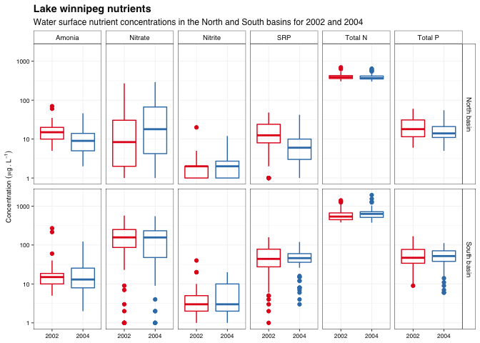

# Week 08 - Homework   Data wrangling - binding and joining tables

Welcome to your assignment for **week 8**. As usual, **Clone** this repo into your own :computer:  using RStudio, as we saw in class.

For this week's assignment you will need to create a short **"report" in an rmarkdown** format with its associated `.md` and `.html` outputs. 

## The data

For this week's assignment we are going to use a dataset of water chemistry data from **Lake Winnipeg** collected by **DFO**. The data is publicly available at the [**DataStream portal**](https://lakewinnipegdatastream.ca/explore/#/dataset/d9f476e5-a80b-4499-9c94-e61d8b83dba3/?ref=map&locations=2140&percentiles=&guideline=&characteristic_media=Surface%2520Water&characteristic_characteristic_name=Silicon&characteristic_method_speciation=&characteristic_sample_fraction=Suspended&characteristic_field=false&characteristic_unit=%25C2%25B5g%252FL).

I have modified the dataset to make it suit the learning objectives of this assignment (i.e. binding and joining tables) as well as to simplify the number of parameters keeping only nutrient (Nitrogen and Phosphorus) data. I have also added a comonly used variable *Basin*, to further explore wether there are any differences between the two basins

## Your tasks

1. Your main task for this homework assignment is to use everything we have seen in class so far to create a summary figure similar to the one below, which would allow us to compare the nutrient loads in the surface water of Lake Winnipeg between 2002 and 2004 as well as between the two basisn.

<!-- -->

While you will need a little nit of everything we have seen so far, the main goal of this assignment is for you to practice binding and joining datasets.

Just like last week, this is not a replication exercise. This figure was made using a theme I created for this class, feel free to apply your own theme. Do try to keep the main elements related to the data itself.

## wrap-up

In addition to being shown inthe final report, the final figure should be saved in `.pdf` format with a width of 190 mm

Finally, once you have completed the exercises, as usual:

- Once you are done with the R script files, save the changes, make sure scripts are properly saved in te **R** folder.
- Commit all the changes to the *repo/R project* (remember to write a commit mesage!)
- **Push** all changes back to **GitHub**
- Go to GitHub and check that it all worked out

## A few hints

- Make sure to save your `.rmd` file in the rmarkdown folder **before** you knit your file
- You will need to use the **{here}** package to correctly load the ditch data into the `.Rmd` file as well as to save the figures.

## Reminder
 
 - In the TidyTuesday assignment and Exam you will be deducted points for not following proper file structure inside your repo/project, so make sure you start developing good practices now. This applies as well to coding style, so make sure to review the [Tidyverse style guide](https://style.tidyverse.org/)

As always, feel free to use [the Issues](https://github.com/UM-R-for-EnvSci-Registered-Student/General-Discussion/issues) section of the of [General Discussion](https://github.com/UM-R-for-EnvSci-Registered-Student/General-Discussion) repo to ask any questions you might have or to share anny issues you come across. 

Note for those of you **still waiting for a final Git/GitHub set up**. You can still use the green button labelled "code" to download a zip version of the repository. You can unzip this anywhere in your computer and open the R project by double clicking the blue cube .RProj file. then you will be able to work on the project, edit and save like you would on any other R project.The only difference, for now, is that you will not be able to "push" the changes back to github, as that folder is not being tracked by Git/GitHub. We will need to find a separate solution for you to get this folder back to me once you are done with the asignment (e.g. zip eail attachment or dropbox/google drive/onedrive link)

Can't wait to see what themes you come up with!

*Happy coding!*

Pepe

