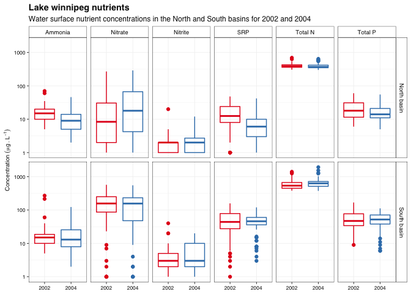

# Data loading

First we start by loading up all the data


```r
low_sites <- read_csv(here("data", "sites.csv"))
```

```
## Rows: 83 Columns: 7
```

```
## ── Column specification ────────────────────────────────────────────────────────
## Delimiter: ","
## chr (5): monitoring_location_id, monitoring_location_name, monitoring_locati...
## dbl (2): monitoring_location_latitude, monitoring_location_longitude
```

```
## 
## ℹ Use `spec()` to retrieve the full column specification for this data.
## ℹ Specify the column types or set `show_col_types = FALSE` to quiet this message.
```

```r
low_sample_log <- read_csv(here("data", "sample_log.csv"))
```

```
## Rows: 332 Columns: 11
```

```
## ── Column specification ────────────────────────────────────────────────────────
## Delimiter: ","
## chr (5): sample_id, monitoring_location_id, activity_type, activity_media_na...
## dbl (6): activity_depth_height_measure, day, month, year, hour, minute
```

```
## 
## ℹ Use `spec()` to retrieve the full column specification for this data.
## ℹ Specify the column types or set `show_col_types = FALSE` to quiet this message.
```

```r
low_results_2002 <- read_csv(here("data", "results_2002.csv"))
```

```
## Rows: 165 Columns: 7
```

```
## ── Column specification ────────────────────────────────────────────────────────
## Delimiter: ","
## chr (1): sample_id
## dbl (6): nitrate, nitrite, ammonia, total_nitrogen_mixed_forms, soluble_reac...
```

```
## 
## ℹ Use `spec()` to retrieve the full column specification for this data.
## ℹ Specify the column types or set `show_col_types = FALSE` to quiet this message.
```

```r
low_results_2004 <- read_csv(here("data", "results_2004.csv"))
```

```
## Rows: 161 Columns: 7
```

```
## ── Column specification ────────────────────────────────────────────────────────
## Delimiter: ","
## chr (1): sample_id
## dbl (6): nitrate, nitrite, ammonia, total_nitrogen_mixed_forms, soluble_reac...
```

```
## 
## ℹ Use `spec()` to retrieve the full column specification for this data.
## ℹ Specify the column types or set `show_col_types = FALSE` to quiet this message.
```

# Data binding and joining

With all the data loaded, we are going to start binding and joining the different oieces to get to our main, combined,dataset

Let's start by binding the two years of results data into one:


```r
low_results <- bind_rows(low_results_2002, low_results_2004)

print(low_results)
```

```
## # A tibble: 326 × 7
##    sample_id nitrate nitrite ammonia total_nitrogen_mixed_forms soluble_reactiv…
##    <chr>       <dbl>   <dbl>   <dbl>                      <dbl>            <dbl>
##  1 W_277         430      20     270                       1400               74
##  2 W_279         270      10      20                        670               41
##  3 W_278          NA       1      10                        435               18
##  4 W_281          86       3      15                        455               33
##  5 W_282          87       3      15                        485               29
##  6 W_283         140       5      10                        540               32
##  7 W_289          NA      NA      10                        430               16
##  8 W_291          NA       1      10                        405               23
##  9 W_298           2       1      15                        445                5
## 10 W_299           9       2      25                        455                8
## # … with 316 more rows, and 1 more variable: total_phosphorus_mixed_forms <dbl>
```

Now that we have our complete hree pieces (sites, sample_log, and results), we want to join thse toguether. For that we will use the `left_join()` function starting by joining the sample log to the site info (using *monitoring_location_id* as our key column) followed by a left yoing with the results data (using *sample_id* as our key column)


```r
low_data <- low_sample_log %>% 
  left_join(low_sites, by = "monitoring_location_id") %>% 
  left_join(low_results, by = "sample_id")

print(low_data)
```

```
## # A tibble: 332 × 23
##    sample_id monitoring_locat… activity_type  activity_media_… activity_depth_h…
##    <chr>     <chr>             <chr>          <chr>                        <dbl>
##  1 W_277     1                 Sample-Routine Surface Water                   NA
##  2 W_278     2                 Sample-Routine Surface Water                   NA
##  3 W_279     3B                Sample-Routine Surface Water                   NA
##  4 W_281     59                Sample-Routine Surface Water                   NA
##  5 W_282     5                 Sample-Routine Surface Water                   NA
##  6 W_283     60C               Sample-Routine Surface Water                   NA
##  7 W_289     57B               Sample-Routine Surface Water                   NA
##  8 W_291     60B               Sample-Routine Surface Water                   NA
##  9 W_298     57                Sample-Routine Surface Water                   NA
## 10 W_299     11                Sample-Routine Surface Water                   NA
## # … with 322 more rows, and 18 more variables:
## #   activity_depth_height_unit <chr>, day <dbl>, month <dbl>, year <dbl>,
## #   hour <dbl>, minute <dbl>, monitoring_location_name <chr>,
## #   monitoring_location_latitude <dbl>, monitoring_location_longitude <dbl>,
## #   monitoring_location_horizontal_coordinate_reference_system <chr>,
## #   monitoring_location_waterbody <chr>, basin <chr>, nitrate <dbl>,
## #   nitrite <dbl>, ammonia <dbl>, total_nitrogen_mixed_forms <dbl>, …
```
# Data processing

Now that we have one single, combine, dataset, we still need to do some processing. 

- First we will use `pivot_longer()` to change the parameter columns into long form.
- Second we will `mutat()` the year variable into a factor to ensure we can create our boxplots.


```r
low_data_long <- low_data %>% 
  pivot_longer(cols = c(nitrate,nitrite,
                        ammonia,
                        total_nitrogen_mixed_forms,
                        soluble_reactive_phosphorus_srp,
                        total_phosphorus_mixed_forms),
               names_to = "parameter",
               values_to = "concentration") %>% 
  mutate(year = factor(year, levels = c("2002", "2004"))) %>% 
  mutate(parameter = str_to_title(parameter)) %>% 
  mutate(parameter = case_when(
    parameter == "Total_nitrogen_mixed_forms" ~ "Total N",
    parameter == "Soluble_reactive_phosphorus_srp" ~ "SRP",
    parameter == "Total_phosphorus_mixed_forms" ~ "Total P",
    TRUE ~ parameter  # This line tells case_when() that any other case just gets whatever value parameter had already
  ))

print(low_data_long)
```

```
## # A tibble: 1,992 × 19
##    sample_id monitoring_locat… activity_type  activity_media_… activity_depth_h…
##    <chr>     <chr>             <chr>          <chr>                        <dbl>
##  1 W_277     1                 Sample-Routine Surface Water                   NA
##  2 W_277     1                 Sample-Routine Surface Water                   NA
##  3 W_277     1                 Sample-Routine Surface Water                   NA
##  4 W_277     1                 Sample-Routine Surface Water                   NA
##  5 W_277     1                 Sample-Routine Surface Water                   NA
##  6 W_277     1                 Sample-Routine Surface Water                   NA
##  7 W_278     2                 Sample-Routine Surface Water                   NA
##  8 W_278     2                 Sample-Routine Surface Water                   NA
##  9 W_278     2                 Sample-Routine Surface Water                   NA
## 10 W_278     2                 Sample-Routine Surface Water                   NA
## # … with 1,982 more rows, and 14 more variables:
## #   activity_depth_height_unit <chr>, day <dbl>, month <dbl>, year <fct>,
## #   hour <dbl>, minute <dbl>, monitoring_location_name <chr>,
## #   monitoring_location_latitude <dbl>, monitoring_location_longitude <dbl>,
## #   monitoring_location_horizontal_coordinate_reference_system <chr>,
## #   monitoring_location_waterbody <chr>, basin <chr>, parameter <chr>,
## #   concentration <dbl>
```

# Plots

With all the data ready to go, we just need to plot


```r
low_plot <- low_data_long %>% 
  ggplot() +
  facet_grid(rows = vars(basin), cols = vars(parameter)) +
  # facet_wrap(~ parameter, nrow = 1) +
  geom_boxplot(aes(x = year, y = concentration, colour = year), fill = NA) +
  scale_y_log10() +
  scale_colour_brewer(palette = "Set1") +
  theme_pepe() +
  theme(legend.position = "none") +
  labs(x = NULL,
       y = expression(Concentration~(mu*g~.~L^{-1})),  # with expression() you can plot math. "~" means a space
       title = "Lake winnipeg nutrients",
       subtitle = "Water surface nutrient concentrations in the North and South basins for 2002 and 2004")

low_plot
```

```
## Warning in self$trans$transform(x): NaNs produced
```

```
## Warning: Transformation introduced infinite values in continuous y-axis
```

```
## Warning: Removed 257 rows containing non-finite values (stat_boxplot).
```

<!-- -->

Let's save it


```r
ggsave(here("figures", "low_plot.pdf"), low_plot, width = 190, height = 120, units = "mm")
```

```
## Warning in self$trans$transform(x): NaNs produced
```

```
## Warning: Transformation introduced infinite values in continuous y-axis
```

```
## Warning: Removed 257 rows containing non-finite values (stat_boxplot).
```


